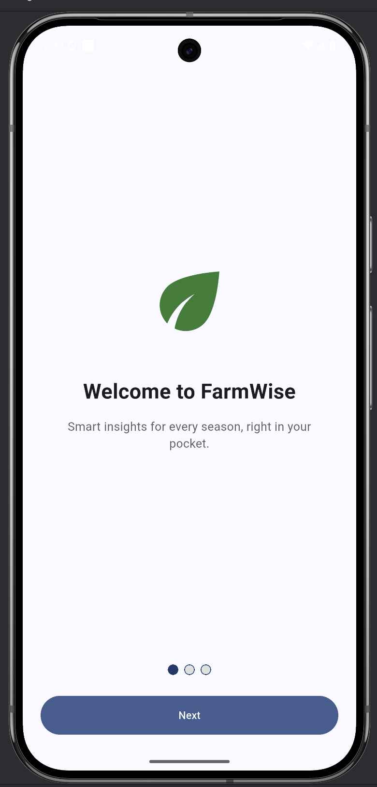

# TabPageSelector Demo

`TabPageSelector` shows a row of dots that indicate the current page in a set of tabs (kept in sync by a `TabController`). This demo uses it in a simple onboarding flow.

## Run

```bash
flutter pub get
flutter run -d chrome
```

## Screenshot



## 3 key attributes

- `controller` — links the dots to the `TabController` (required).
- `selectedColor` — color of the active dot.
- `color` — color of the inactive dots.
